<!-- Animated Waving Header -->
 

<h1 align="center">
  Hey, I'm Shanto! 
</h1>

  

  

 

## 📬 About me -- Contact

<h1> Hey! Nice to see you.</h1>

- **Email**: [shantosaha047@gmail.com](mailto:shantosaha047@gmail.com)
- **GitHub**: [github.com/shantosaha](https://github.com/shantosaha)

> [!IMPORTANT]
> Don't take urself too seriously, we're all pretty dumbs here.

---

## 🛠️ Things I code with

  
  
  
  
  
  
  
  
  
  
  

---

## 🎁 Open source projects

<table>
  <thead align="center">
    <tr border: none;>
      <td><b>Project</b></td>
      <td><b>⭐ Stars</b></td>
      <td><b>📚 Forks</b></td>
      <td><b>🛎 Issues</b></td>
      <td><b>📬 Pull requests</b></td>
    </tr>
  </thead>
  <tbody>
    <tr>
      <td><a href="https://github.com/shantosaha/Antigravity-Seamless-Pipeline"><b>Antigravity-Seamless-Pipeline</b></a></td>
      <td></td>
      <td></td>
      <td></td>
      <td></td>
    </tr>
    <tr>
      <td><a href="https://github.com/shantosaha/awesome-n8n-templates"><b>Awesome n8n Templates</b></a></td>
      <td></td>
      <td></td>
      <td></td>
      <td></td>
    </tr>
    <tr>
      <td><a href="https://github.com/shantosaha/Claw-Master-V3.2"><b>Claw-Master-V3.2</b></a></td>
      <td></td>
      <td></td>
      <td></td>
      <td></td>
    </tr>
  </tbody>
</table>

---

## 📊 My Stats

  

 

  
  

 

  

 

<!-- Animated Waving Footer -->

